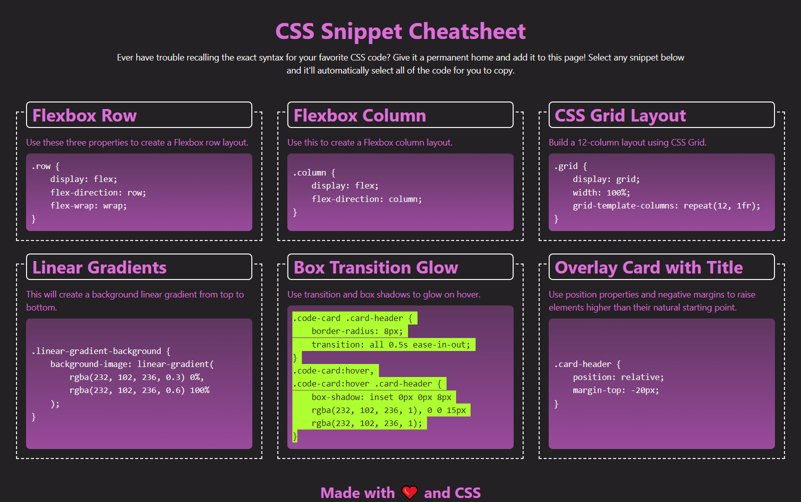

# CSS_Snippet_Cheat_Sheet

## Description
This website is a mini project for the Skills for Life Bootcamp but it is also a helper website for newbie developers to find code snippets for their CSS.

## Usage
As I mentioned above the webpage is designed for newbie developers to provide code snippets for their projects or practice reasons. As a user you can find a collection of labelled CSS snippet in a responsive grid. See the picture below:

You can also highlight a code snippet by simply clicking on it as you can see on the picture below:

## Credits
N/A

## License
Plese refer to the LICENSE file in the repo.